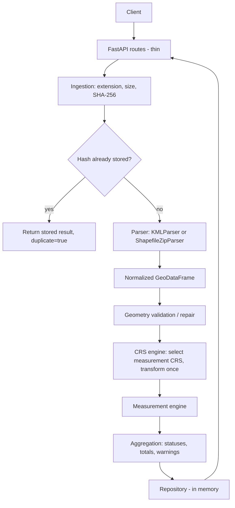

# GeoMeasure API

*Production-minded geospatial file processing and measurement service.*

## Overview

Upload a **KML** file or a **ZIP containing an ESRI Shapefile**. GeoMeasure parses the features,
works out which coordinate reference system (CRS) they use, projects them into a CRS that is
suitable for measuring, and returns per-feature **area** and **length** together with an
explanation of *how* each number was produced.

```
Geographic coordinates -> extent centre -> UTM zone -> projected CRS -> transform once -> area / length
```

## Why This Project

Naively calling `.area` on a polygon in latitude/longitude returns square *degrees*, which is not a
useful unit. The core rule of this project is:

> Never calculate planar measurements directly from latitude/longitude degrees.

Everything else (parsers, validation, error isolation, security) exists so that this rule is
applied reliably to messy real-world uploads.

## Features

- KML and Shapefile-ZIP input behind a common parser interface
- Automatic UTM zone selection (northern and southern hemisphere); no hard-coded CRS
- Projected source CRSs are respected, with unit conversion for non-metre CRSs
- Per-feature geometry validation and safe repair (`make_valid`)
- Feature-level error isolation: one bad feature never fails the file
- Every measurement carries its method: measurement CRS, projection name, unit factor, notes
- ZIP hardening: path traversal, entry count, uncompressed size, symlinks, encryption
- SHA-256 duplicate detection, UUID4 file IDs
- Pagination, geometry-type filter, summary endpoint, optional GeoJSON export
- Structured JSON errors with sensible HTTP status codes; no stack traces in responses
- Typed Pydantic v2 schemas and OpenAPI docs

## Architecture



More detail in [docs/architecture.md](docs/architecture.md).

## Technology Stack

Python 3.11+, FastAPI, Uvicorn, Pydantic v2, pydantic-settings, GeoPandas, Shapely 2, PyProj,
Pyogrio, python-multipart; pytest, httpx and Ruff for quality. No database, queue, cache or auth.

## Project Structure

```
app/
  main.py            app factory, exception handlers
  config.py          pydantic-settings configuration
  api/               thin routes (files, health)
  core/              exceptions, logging, security helpers
  models/            enums and Pydantic schemas
  services/          ingestion, parser, geometry, crs, measurement, processor,
                     serialization, reporting
  storage/memory.py  repository protocol + in-memory implementation
tests/               pytest suite
examples/            sample.kml, sample_shapefile.zip
scripts/benchmark.py lightweight benchmark
docs/architecture.md
```

## Installation

```bash
python -m venv .venv
source .venv/bin/activate          # Linux/macOS
# .venv\Scripts\activate           # Windows
pip install -r requirements.txt
```

GeoPandas, Shapely, PyProj and Pyogrio ship binary wheels that bundle GEOS, PROJ and GDAL on
common platforms, so no system GDAL is normally needed. If a wheel is not available for your
platform/Python version, install GDAL/GEOS/PROJ system libraries first (or use conda-forge).
Use a fresh virtual environment to avoid version clashes with another GDAL on your machine.

## Running Locally

```bash
uvicorn app.main:app --reload
```

Configuration comes from environment variables or a `.env` file (see `.env.example`):
`APP_NAME`, `APP_VERSION`, `MAX_UPLOAD_MB` (25), `MAX_ZIP_FILES` (25),
`MAX_ZIP_UNCOMPRESSED_MB` (100), `STORAGE_DIR` (`output`, used only for temporary extraction)
and `LOG_LEVEL`.

## API Documentation

| URL | Content |
|---|---|
| http://127.0.0.1:8000/docs | Swagger UI (upload `examples/sample.kml` directly) |
| http://127.0.0.1:8000/redoc | ReDoc |
| http://127.0.0.1:8000/openapi.json | OpenAPI schema |

### Why FastAPI

Automatic OpenAPI/Swagger documentation, Pydantic validation and typed request/response schemas,
good developer experience, native async multipart upload handling, and a natural fit for the
Python geospatial ecosystem. CPU-bound processing runs in a worker thread so the event loop stays
responsive.

## API Endpoints

| Method | Path | Purpose |
|---|---|---|
| POST | `/api/files/` | Upload and process a file (201; 200 if duplicate) |
| GET | `/api/files/{id}` | File metadata |
| GET | `/api/files/{id}/measurements/` | Feature results; `page`, `page_size` (1-100), `geometry_type` |
| GET | `/api/files/{id}/summary/` | Status counts and totals |
| GET | `/api/files/{id}/geojson` | Optional: features as WGS84 GeoJSON |
| GET | `/health` | Liveness |

Status codes: 400 malformed request/empty file/invalid query, 404 unknown ID, 413 too large,
415 unsupported type, 422 invalid archive/CRS/geospatial content, 500 unexpected.

## Example Request

```bash
curl -X POST http://127.0.0.1:8000/api/files/ -F "file=@examples/sample.kml"
curl http://127.0.0.1:8000/api/files/{id}/measurements/
curl "http://127.0.0.1:8000/api/files/{id}/measurements/?geometry_type=Polygon&page_size=10"
curl http://127.0.0.1:8000/api/files/{id}/summary/
```

## Example Response

Upload of `examples/sample_shapefile.zip` (three rectangles in EPSG:32644 with known sizes),
first item of `/measurements/`:

```json
{
  "feature_index": 0,
  "feature_id": "0",
  "geometry_type": "Polygon",
  "properties": {"NAME": "Plot 1", "CATEGORY": "residential"},
  "geometry_valid": true,
  "geometry_repaired": false,
  "crs": {"source": "<as read from .prj>", "measurement": "<same, already projected>"},
  "measurement": {"type": "area", "value": 20000.0, "unit": "m²"},
  "measurement_method": {
    "method": "source_projected_crs",
    "measurement_crs": "<as above>",
    "projection": "<CRS name>",
    "unit_conversion_factor": 1.0,
    "notes": []
  },
  "status": "SUCCESS",
  "warnings": [],
  "errors": []
}
```

For a KML file, `method` is `projected_crs`, the measurement CRS is the selected UTM zone
(e.g. `EPSG:32644` for Chennai), and `notes` states that EPSG:4326 was assumed per the KML spec.

## Geospatial Processing Pipeline

upload -> extension/size validation -> SHA-256 -> duplicate check -> parse (ZIPs are validated and
extracted into a `TemporaryDirectory`) -> CRS validation -> geometry validation/repair ->
measurement CRS selection -> **one** transformation of all usable geometries -> per-feature
measurement -> aggregation -> store -> response. Temporary files are removed in all cases.

## CRS Strategy

- **KML**: no CRS metadata exists; the KML specification mandates WGS84, so `EPSG:4326` is assumed
  explicitly (and reported in `measurement_method.notes`).
- **Shapefile**: CRS comes from the `.prj`. A missing or unreadable `.prj` is rejected with
  `MISSING_CRS`; a guessed CRS would silently produce wrong numbers.
- **Geographic source** -> local UTM zone. **Metric projected source** -> used as-is.
  **Non-metre projected source** (e.g. US feet) -> used as-is with an explicit conversion factor.
  **Web Mercator source** -> treated as unsuitable and re-projected to UTM.
- One measurement CRS is chosen per dataset so all features are comparable; it is stored in the
  file metadata.

## Why Projected CRS?

Degrees are angles, not lengths. One degree of longitude is about 111 km at the equator and
shrinks to zero at the poles, so area in "degrees squared" cannot be converted to square metres
with a single factor. A projected CRS maps the surface to a plane with metre units, where
`geometry.area` and `geometry.length` are meaningful.

Web Mercator (EPSG:3857) is a *display* projection: it preserves shape locally but inflates scale
with latitude (areas grow by `1/cos²(lat)`, about 4x at 60 degrees), so it is a poor choice for
measurement and is deliberately not used.

## Automatic UTM Selection

`estimate_measurement_crs` takes the dataset bounding box (transforming only the box corners to
lon/lat when the source is projected), uses its centre, and computes
`zone = floor((lon + 180) / 6) + 1`, then `32600 + zone` (north) or `32700 + zone` (south).
The formula is used instead of `GeoSeries.estimate_utm_crs()` so the logic is explicit and
testable; a test checks that the two agree for sample locations in both hemispheres.

**Limitations**: a single UTM zone is accurate for survey-sized extents but degrades for datasets
spanning several zones (the API adds a warning when the extent exceeds 6 degrees of longitude).
Latitudes beyond 84N/80S (outside UTM) are rejected. Norway/Svalbard zone exceptions and
antimeridian-crossing datasets are not handled. Geodesic (ellipsoidal) measurement or per-feature
zones would be the next step.

## Geometry Validation

Each geometry is checked with `is_valid`. Only invalid ones go through `make_valid`, and a repair
is accepted only if the result stays in the same geometry family (polygonal parts are extracted
from a `GeometryCollection`). Results are reported as `geometry_valid` / `geometry_repaired`, with a
warning on repaired features. Unrepairable, empty or missing geometries fail that feature only.

## Error Isolation

Feature results carry `status` (`SUCCESS`, `FAILED`, `UNSUPPORTED_GEOMETRY`) plus `warnings` and
`errors`. File status is `COMPLETED`, `COMPLETED_WITH_WARNINGS` (any failed, unsupported or
repaired feature, or an accuracy note) or `FAILED` (no feature succeeded). Points count as
successful: they are valid but have no measurement. Dataset-level problems (corrupt ZIP, missing
CRS, malformed KML) are rejected outright and are not stored.

## ZIP Security

Entry names are rejected if absolute, drive-qualified or containing `..`; entry count and declared
uncompressed size are capped; encrypted entries and symlinks are rejected; each target path is
re-resolved to confirm it stays inside the temporary directory; and the bytes actually written are
counted, because declared sizes in a ZIP header can be falsified. Extraction happens inside
`tempfile.TemporaryDirectory()`; nothing is executed. Exactly one `.shp` per archive is accepted
(`.shx` and `.dbf` required, `.prj` required for CRS).

## Duplicate Detection

SHA-256 is computed while the upload is read. If identical bytes were already processed during the
current application lifetime, the stored result is returned with HTTP 200 and `duplicate=true`
instead of being reprocessed. The hash identifies content; it is not an authentication mechanism.

## Measurement Methodology

Area uses `geometry.area`, length uses `geometry.length`, always after transformation, and the
engine refuses to run in a geographic CRS. Output is in m² and m (non-metre CRSs are converted
with the CRS's own unit factor). Full precision is kept internally; API values and totals are
rounded to 2 decimals. Totals report area and length separately and are never combined. Shapefile
Z values are ignored; all measurements are planar 2D.

## Testing

```bash
pytest
pytest -v
ruff check .
ruff format --check .
```

The suite covers uploads, ZIP security, CRS selection (including southern hemisphere, projected,
feet-based and Web Mercator sources), geometry repair, known areas and lengths, a comparison with
geodesic area, feature isolation, pagination/filtering and structured errors.

## Performance

Parsing, validation, transformation and measurement each run once per file; all usable geometries
are transformed in a single call. Each response includes `processing_time_ms`, and the processor
logs per-file duration. Uploads are read in chunks with the limit enforced during the read.

```bash
python scripts/benchmark.py
```

| Dataset | Features | Size | Processing Time |
|---|---|---|---|
| *run `scripts/benchmark.py` on your machine and paste measured values here* | | | |

No benchmark numbers are included because none were measured for this repository.

## Design Decisions

- **GeoPandas / Shapely / PyProj**: de-facto Python stack for vector I/O, geometry operations and
  CRS transformations; reimplementing any of it would be riskier than using it.
- **Hand-written KML parser**: removes dependence on GDAL's optional KML driver and gives per-
  Placemark error isolation. Altitude is dropped. It uses the standard library XML parser, which
  does not fetch external entities; `defusedxml` would be a sensible hardening step.
- **Synchronous processing**: results are returned in the POST response, which keeps the API simple;
  the work runs in a thread pool. The processor is isolated so it can move to a worker later.
- **In-memory storage**: intentional for the assignment because persistent storage was not a
  requirement. A restart clears all results. The `ResultRepository` protocol marks the seam for
  PostgreSQL/PostGIS or S3.
- **Feature-level isolation**: real files contain a few bad features; failing the whole upload would
  be unhelpful.
- **Feature index / ID**: 0-based position in the source; a KML Placemark `id` is used when present.
  Shapefiles have no stable ID, so the row position is used.
- **Temporary extraction**: archives are never extracted into the application tree.
- **No database / Celery / Redis**: not needed for the problem, and would add operational surface
  without improving correctness.

## Limitations

In-memory storage; synchronous processing; local temporary storage; single-process assumptions
(duplicate detection and results are per process); UTM accuracy for very large extents; no
authentication; no rate limiting; no persistent object storage; upload bodies are buffered by the
ASGI server before size checks run, so a reverse proxy should also cap request size.

## Future Improvements (not implemented)

PostGIS persistence, S3/object storage, background jobs (Redis + workers), SSE/WebSocket progress,
asynchronous large-file processing, geodesic measurement, multi-zone CRS strategies, GeoJSON
download, GeoPackage and GeoJSON input, raster processing, authentication, rate limiting,
observability (metrics/tracing), distributed processing.

Scale-up sketch: `FastAPI -> job API -> Redis -> worker -> PostGIS/S3 -> result API`.
Million-feature datasets would need streaming reads, chunked processing and database-side
aggregation rather than one in-memory GeoDataFrame.

## Engineering Learnings

What I learned: how KML and Shapefile differ (and why a Shapefile is really several files); how
CRS and projection choice change measurements; why geometry validity matters; how to extract
archives safely; how FastAPI handles multipart uploads; designing for feature-level fault isolation;
checking measurement accuracy against an independent geodesic calculation; structuring a
processing pipeline; and keeping API code separate from domain logic.

## Assignment Compliance

### Assignment Requirements

| Requirement | Implementation |
|---|---|
| FastAPI | `app/main.py`, `app/api/` |
| KML | `KMLParser` |
| Shapefile ZIP | `ShapefileZipParser` + `core/security.py` |
| Polygon / MultiPolygon area | `services/measurement.py` |
| LineString / MultiLineString length | `services/measurement.py` |
| Point / MultiPoint | no measurement (`null`) |
| CRS handling | `services/crs.py` |
| File metadata | `FileInfoResponse` at `GET /api/files/{id}` |
| Measurements endpoint | `GET /api/files/{id}/measurements/` |
| Summary endpoint | `GET /api/files/{id}/summary/` |
| Error isolation | `services/processor.py`, `services/geometry.py` |
| Tests | `tests/` (pytest) |
| Documentation | this README, `docs/architecture.md`, `/docs` |
