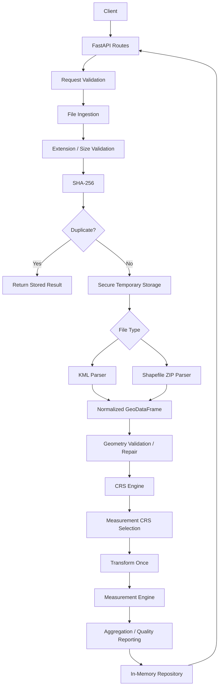

# GeoMeasure API

*Production-minded geospatial file processing and measurement service.*

## Overview

GeoMeasure API is a FastAPI-based backend service for processing vector geospatial files and producing reliable, CRS-aware measurements.

Upload a **KML** file or a **ZIP containing an ESRI Shapefile**. GeoMeasure parses the features, validates their geometries, determines the source coordinate reference system (CRS), selects a suitable projected CRS for measurement, and returns per-feature **area** and **length** together with an explanation of *how* each number was produced.

```text
Geographic coordinates
        ↓
Dataset extent centre
        ↓
UTM zone selection
        ↓
Projected CRS
        ↓
Transform once
        ↓
Area / Length measurement
```

The project is intentionally focused on the core geospatial backend problem rather than adding unnecessary infrastructure such as a frontend, database, queue, or authentication layer.

---

## Why This Project

Geospatial measurements require more than simply calling geometry methods.

Naively calling `.area` on a polygon represented in latitude/longitude returns square *degrees*, which is not a meaningful physical measurement.

The core rule of this project is:

> **Never calculate planar measurements directly from latitude/longitude degrees.**

GeoMeasure therefore transforms geographic geometries into an appropriate projected CRS before calculating area or length.

The same principle applies to validation, parsing, and error handling: the application is designed so that geospatial correctness is preserved throughout the processing pipeline.

---

## Key Features

* KML and Shapefile-ZIP input behind a common parser interface
* Automatic UTM zone selection for northern and southern hemispheres
* No hard-coded measurement CRS
* Geographic CRS transformation before measurement
* Projected source CRSs respected
* Non-metre projected CRSs handled using explicit unit conversion
* Web Mercator re-projected before measurement
* Per-feature geometry validation
* Safe geometry repair using `make_valid`
* Feature-level error isolation
* Detailed measurement methodology metadata
* Secure ZIP extraction
* ZIP path traversal protection
* ZIP entry count and uncompressed-size limits
* Symlink and encrypted-entry rejection
* SHA-256 duplicate detection
* UUID4 file IDs
* Pagination
* Geometry-type filtering
* File summary endpoint
* Geospatial quality report endpoint
* WGS84 GeoJSON export
* Structured JSON errors
* Typed Pydantic v2 schemas
* OpenAPI / Swagger documentation
* In-memory repository abstraction
* Processing-time measurements
* Automated pytest suite
* Ruff linting and formatting
* Performance benchmarking

---

# Architecture



More architectural details are available in:

`docs/architecture.md`

---

# Technology Stack

| Technology        | Purpose                            |
| ----------------- | ---------------------------------- |
| Python 3.11+      | Application language               |
| FastAPI           | REST API framework                 |
| Uvicorn           | ASGI server                        |
| Pydantic v2       | Request/response validation        |
| pydantic-settings | Configuration                      |
| GeoPandas         | Vector geospatial processing       |
| Shapely 2         | Geometry operations                |
| PyProj            | CRS and coordinate transformations |
| Pyogrio           | Geospatial file I/O                |
| pytest            | Automated testing                  |
| httpx             | API testing                        |
| Ruff              | Linting and formatting             |

The project deliberately does **not** require a database, queue, cache, authentication system, or frontend for the current assignment implementation.

---

# Project Structure

```text
geomasure-api/
│
├── app/
│   ├── main.py
│   ├── config.py
│   │
│   ├── api/
│   │   ├── routes_files.py
│   │   └── routes_health.py
│   │
│   ├── core/
│   │   ├── exceptions.py
│   │   ├── logging.py
│   │   └── security.py
│   │
│   ├── models/
│   │   ├── enums.py
│   │   └── schemas.py
│   │
│   ├── services/
│   │   ├── ingestion.py
│   │   ├── parser.py
│   │   ├── geometry.py
│   │   ├── crs.py
│   │   ├── measurement.py
│   │   ├── processor.py
│   │   ├── serialization.py
│   │   └── reporting/
│   │
│   └── storage/
│       └── memory.py
│
├── tests/
│   ├── conftest.py
│   ├── test_api.py
│   ├── test_crs.py
│   ├── test_error_handling.py
│   ├── test_geometry.py
│   ├── test_kml.py
│   ├── test_measurements.py
│   ├── test_quality.py
│   ├── test_security.py
│   ├── test_shapefile.py
│   └── test_upload.py
│
├── examples/
│   ├── sample.kml
│   └── sample_shapefile.zip
│
├── scripts/
│   └── benchmark.py
│
├── docs/
│   └── architecture.md
│
├── output/
│   └── .gitkeep
│
├── .env.example
├── .gitignore
├── README.md
├── requirements.txt
├── pyproject.toml
└── run.py
```

---

# Installation

Create a fresh Python virtual environment:

```bash
python -m venv .venv
```

### Linux / macOS

```bash
source .venv/bin/activate
```

### Windows PowerShell

```powershell
.venv\Scripts\Activate.ps1
```

Install dependencies:

```bash
pip install -r requirements.txt
```

GeoPandas, Shapely, PyProj and Pyogrio provide binary wheels containing the required geospatial components on common platforms.

If a compatible wheel is unavailable for a particular platform or Python version, the required GDAL/GEOS/PROJ system dependencies may need to be installed separately.

A fresh virtual environment is recommended to avoid conflicts with other GDAL/GEOS/PROJ installations.

---

# Running Locally

Start the application:

```bash
uvicorn app.main:app --reload
```

The API will be available at:

```text
http://127.0.0.1:8000
```

Swagger UI:

```text
http://127.0.0.1:8000/docs
```

ReDoc:

```text
http://127.0.0.1:8000/redoc
```

OpenAPI schema:

```text
http://127.0.0.1:8000/openapi.json
```

---

# Configuration

Configuration is loaded from environment variables or a `.env` file.

See:

```text
.env.example
```

Available settings include:

```text
APP_NAME
APP_VERSION
MAX_UPLOAD_MB
MAX_ZIP_FILES
MAX_ZIP_UNCOMPRESSED_MB
STORAGE_DIR
LOG_LEVEL
```

Default limits include:

```text
MAX_UPLOAD_MB=25
MAX_ZIP_FILES=25
MAX_ZIP_UNCOMPRESSED_MB=100
STORAGE_DIR=output
LOG_LEVEL=INFO
```

`STORAGE_DIR` is used for controlled temporary extraction and does not represent persistent application storage.

---

# API Documentation

FastAPI automatically provides interactive OpenAPI documentation.

| URL             | Purpose        |
| --------------- | -------------- |
| `/docs`         | Swagger UI     |
| `/redoc`        | ReDoc          |
| `/openapi.json` | OpenAPI schema |

Swagger can be used to upload:

```text
examples/sample.kml
```

and inspect the API responses without requiring a separate frontend.

---

# API Endpoints

| Method | Path                            | Purpose                                    |
| ------ | ------------------------------- | ------------------------------------------ |
| POST   | `/api/files/`                   | Upload and process a geospatial file       |
| GET    | `/api/files/{id}`               | Retrieve file metadata                     |
| GET    | `/api/files/{id}/measurements/` | Retrieve feature measurements              |
| GET    | `/api/files/{id}/summary/`      | Retrieve aggregated results                |
| GET    | `/api/files/{id}/quality/`      | Retrieve geospatial quality information    |
| GET    | `/api/files/{id}/geojson`       | Export processed features as WGS84 GeoJSON |
| GET    | `/health`                       | Health / liveness check                    |

### Upload status

A new file returns:

```text
HTTP 201
```

An identical file uploaded again during the current application lifetime returns:

```text
HTTP 200
duplicate=true
```

### Common status codes

| Status | Meaning                                    |
| -----: | ------------------------------------------ |
|    200 | Successful retrieval / duplicate           |
|    201 | New file successfully processed            |
|    400 | Invalid request                            |
|    404 | File not found                             |
|    413 | File too large                             |
|    415 | Unsupported file type                      |
|    422 | Invalid archive / CRS / geospatial content |
|    500 | Unexpected server error                    |

---

# Example Request

Upload a KML file:

```bash
curl -X POST \
  http://127.0.0.1:8000/api/files/ \
  -F "file=@examples/sample.kml"
```

Retrieve measurements:

```bash
curl \
  http://127.0.0.1:8000/api/files/{id}/measurements/
```

Filter by geometry type:

```bash
curl \
  "http://127.0.0.1:8000/api/files/{id}/measurements/?geometry_type=Polygon&page_size=10"
```

Retrieve summary:

```bash
curl \
  http://127.0.0.1:8000/api/files/{id}/summary/
```

Retrieve quality information:

```bash
curl \
  http://127.0.0.1:8000/api/files/{id}/quality/
```

Retrieve GeoJSON:

```bash
curl \
  http://127.0.0.1:8000/api/files/{id}/geojson
```

---

# Example Response

For the sample Shapefile containing three known-size rectangles:

```json
{
  "feature_index": 0,
  "feature_id": "0",
  "geometry_type": "Polygon",
  "properties": {
    "NAME": "Plot 1",
    "CATEGORY": "residential"
  },
  "geometry_valid": true,
  "geometry_repaired": false,
  "crs": {
    "source": "<as read from .prj>",
    "measurement": "<same, already projected>"
  },
  "measurement": {
    "type": "area",
    "value": 20000.0,
    "unit": "m²"
  },
  "measurement_method": {
    "method": "source_projected_crs",
    "measurement_crs": "<as above>",
    "projection": "<CRS name>",
    "unit_conversion_factor": 1.0,
    "notes": []
  },
  "status": "SUCCESS",
  "warnings": [],
  "errors": []
}
```

For KML, the source CRS is explicitly treated as WGS84 / EPSG:4326 and transformed into the selected projected measurement CRS.

---

# Geospatial Processing Pipeline

The complete processing pipeline is:

```text
Upload
  ↓
Extension Validation
  ↓
Size Validation
  ↓
SHA-256 Hash
  ↓
Duplicate Check
  ↓
Secure Temporary Storage
  ↓
Format Detection
  ↓
KML / Shapefile Parser
  ↓
Normalized GeoDataFrame
  ↓
CRS Validation
  ↓
Geometry Validation / Repair
  ↓
Measurement CRS Selection
  ↓
Single Transformation
  ↓
Per-Feature Measurement
  ↓
Aggregation
  ↓
Quality Reporting
  ↓
Result Storage
  ↓
API Response
```

Temporary files are removed after processing.

---

# CRS Strategy

Coordinate Reference Systems are a central part of GeoMeasure's design.

## KML

KML does not provide arbitrary CRS metadata in the same way as formats such as Shapefile.

KML coordinates are defined using WGS84.

Therefore:

```text
KML → EPSG:4326
```

is explicitly assumed and reported in the measurement methodology.

## Shapefile

The CRS is read from the `.prj` file.

If the `.prj` file is missing or unreadable, the upload is rejected with:

```text
MISSING_CRS
```

The application does not silently guess the CRS because an incorrect CRS could produce incorrect measurements.

## Geographic Source CRS

A geographic source CRS is transformed into an appropriate local UTM zone.

## Projected Source CRS

A suitable projected source CRS can be used directly.

## Non-Metre Projected CRS

If the projected CRS uses units such as US survey feet, the CRS unit conversion factor is applied explicitly.

## Web Mercator

EPSG:3857 is treated as unsuitable for accurate measurement and is re-projected into an appropriate UTM CRS.

---

# Why Projected CRS?

Latitude and longitude are angular coordinates.

For example:

```text
EPSG:4326
longitude, latitude
```

does not represent:

```text
x meters, y meters
```

Therefore, this is not an appropriate measurement operation:

```python
geometry.area
```

when `geometry` is still in EPSG:4326.

A projected CRS maps geographic coordinates onto a planar coordinate system with suitable linear units.

The application therefore follows:

```text
Geographic CRS
      ↓
Projected CRS
      ↓
Metric measurement
```

---

# Web Mercator and Measurement

Web Mercator:

```text
EPSG:3857
```

is widely used for web maps and visualization.

However, scale distortion increases with latitude.

For example, at approximately 60° latitude, the scale distortion is substantial and area distortion is approximately:

```text
1 / cos²(latitude)
```

or roughly four times the equatorial scale factor.

Therefore, GeoMeasure does not use Web Mercator as its preferred measurement CRS.

---

# Automatic UTM Selection

The application determines the measurement CRS dynamically.

The dataset extent is used to determine the approximate geographic centre.

The UTM zone is calculated using:

```text
zone = floor((longitude + 180) / 6) + 1
```

For northern hemisphere datasets:

```text
EPSG = 32600 + zone
```

For southern hemisphere datasets:

```text
EPSG = 32700 + zone
```

This logic is explicit and testable rather than relying on a single hard-coded CRS.

The implementation also validates that the selected latitude is within the practical UTM range.

---

# UTM Limitations

UTM is well suited to localized survey-sized datasets.

However, a single UTM zone becomes less appropriate for datasets spanning several zones.

The application therefore reports an accuracy warning when the dataset extent exceeds approximately six degrees of longitude.

Current limitations include:

* No Norway-specific UTM zone exceptions
* No Svalbard-specific UTM zone exceptions
* No antimeridian-crossing strategy
* UTM not used outside 84°N / 80°S
* One measurement CRS per dataset

Future versions could support geodesic measurements, regional projections, or multi-zone processing.

---

# Geometry Validation

Every feature is validated independently.

Supported geometry types include:

```text
Point
MultiPoint
LineString
MultiLineString
Polygon
MultiPolygon
```

Invalid geometries are passed through a safe repair process where appropriate.

The result records:

```text
geometry_valid
geometry_repaired
```

A repaired feature also receives a warning.

Unrepairable, empty, or missing geometries fail only that feature.

---

# Degenerate Geometry

Floating-point calculations can produce extremely small values for geometries that are effectively zero-sized.

For example:

```text
0.00000000000001
```

may represent a numerical artifact rather than meaningful area.

GeoMeasure therefore uses tolerance-based comparisons for degenerate geometry detection.

This avoids treating floating-point noise as a real measurement.

---

# Error Isolation

Features are processed independently.

For example:

```text
Feature 0 → Valid Polygon
Feature 1 → Valid LineString
Feature 2 → Invalid Polygon
Feature 3 → Valid Point
```

The result can be:

```text
Feature 0 → SUCCESS
Feature 1 → SUCCESS
Feature 2 → FAILED
Feature 3 → SUCCESS
```

The file can therefore be reported as:

```text
COMPLETED_WITH_WARNINGS
```

rather than failing the entire upload.

Dataset-level problems such as:

* Corrupt ZIP
* Missing CRS
* Malformed KML
* Unsupported format

are rejected at the dataset level.

---

# Measurement Methodology

Measurements are calculated only after CRS processing.

## Polygon

```text
geometry.area
```

Output:

```text
m²
```

## MultiPolygon

The total area of polygonal components is calculated.

## LineString

```text
geometry.length
```

Output:

```text
m
```

## MultiLineString

The combined line length is calculated.

## Point

Points have no area or line length.

Therefore:

```json
{
  "measurement": null,
  "status": "SUCCESS"
}
```

A Point is not treated as a failed feature simply because it has no applicable measurement.

---

# Measurement Metadata

Each measurement contains methodology information.

Example:

```json
{
  "method": "projected_crs",
  "measurement_crs": "EPSG:32644",
  "projection": "WGS 84 / UTM zone 44N",
  "unit_conversion_factor": 1.0,
  "notes": []
}
```

This makes the result explainable rather than returning only a number.

---

# Precision and Units

The implementation:

* Keeps full precision internally
* Uses CRS-specific units
* Converts non-metre projected units explicitly
* Returns metric area and length
* Rounds API values and totals to two decimal places
* Processes geometries as 2D planar geometry
* Ignores Shapefile Z values for measurement

Area and length totals are kept separate and are never combined into a meaningless aggregate.

---

# ZIP Security

Shapefiles are commonly distributed as ZIP archives.

Uploaded ZIP files are treated as untrusted input.

The application protects against:

* Path traversal
* Absolute paths
* Drive-qualified paths
* Excessive archive entries
* Excessive uncompressed size
* Encrypted archive members
* Symlink entries
* Unsafe extraction paths

Every extracted target path is resolved and checked to ensure it remains inside the temporary directory.

The application also counts bytes actually written during extraction because ZIP header values can be manipulated.

Extraction occurs inside:

```python
tempfile.TemporaryDirectory()
```

No archive content is executed.

Exactly one `.shp` file is accepted per archive.

Required Shapefile components include:

```text
.shp
.shx
.dbf
.prj
```

---

# Duplicate Detection

Each uploaded file receives a SHA-256 content hash.

Conceptually:

```text
File
 ↓
SHA-256
 ↓
Content Fingerprint
```

If identical content was already processed during the current application lifetime, the existing result is returned instead of processing the file again.

Example:

```json
{
  "duplicate": true,
  "file_id": "existing-file-id"
}
```

The duplicate request returns:

```text
HTTP 200
```

The hash is a content fingerprint and is not used as an authentication mechanism.

---

# Quality Reporting

GeoMeasure provides a dedicated quality endpoint:

```text
GET /api/files/{id}/quality/
```

The quality report can summarize information such as:

* Total feature count
* Valid geometries
* Repaired geometries
* Invalid geometries
* Measured features
* Unsupported / non-measurement features
* Failed features
* CRS transformation status
* Warnings

This provides a quick assessment of the quality of the uploaded dataset without requiring clients to inspect every feature individually.

---

# GeoJSON Export

The application provides:

```text
GET /api/files/{id}/geojson
```

The endpoint returns processed features as a WGS84 GeoJSON `FeatureCollection`.

Example structure:

```json
{
  "type": "FeatureCollection",
  "features": [
    {
      "type": "Feature",
      "geometry": {},
      "properties": {}
    }
  ]
}
```

This makes the results interoperable with web mapping tools and GIS applications.

---

# Storage Architecture

The current implementation uses an in-memory repository.

This is intentional.

The assignment focuses on:

* File processing
* Geospatial correctness
* CRS handling
* Geometry validation
* Measurements
* API design
* Security
* Testing

Persistent storage is therefore outside the core scope.

The storage layer is separated behind a repository interface so that a future implementation could use:

```text
PostgreSQL
PostGIS
S3 / Object Storage
```

without redesigning the processing pipeline.

### Current limitation

Application restart clears stored results.

Results are also process-local.

---

# Logging and Observability

The application logs important processing information such as:

* File ID
* Filename
* Processing start
* Processing end
* Processing duration
* Feature count
* Warnings
* Errors

The application does not log complete file contents or unnecessary geometry data.

Processing duration is exposed as part of file processing metadata and can be used for performance analysis.

---

# Testing

The project contains a comprehensive automated test suite.

Run:

```bash
pytest
```

Verbose mode:

```bash
pytest -v
```

Code quality:

```bash
ruff check .
```

Formatting verification:

```bash
ruff format --check .
```

---

# Test Results

Latest verified result:

```text
105 passed
1 warning
```

Execution time:

```text
1.34 seconds
```

The warning is a dependency deprecation warning originating from the installed Starlette/FastAPI test-client dependency chain. It does not cause any test failure.

### Test coverage areas

| Area                | Result |
| ------------------- | ------ |
| API endpoints       | PASS   |
| File upload         | PASS   |
| KML parsing         | PASS   |
| Shapefile parsing   | PASS   |
| CRS handling        | PASS   |
| UTM selection       | PASS   |
| Geometry validation | PASS   |
| Geometry repair     | PASS   |
| Measurements        | PASS   |
| Quality reporting   | PASS   |
| ZIP security        | PASS   |
| Duplicate detection | PASS   |
| Error handling      | PASS   |
| Pagination          | PASS   |
| Filtering           | PASS   |
| GeoJSON export      | PASS   |

---

# Code Quality

Ruff verification:

```text
All checks passed!
```

Formatting verification:

```text
42 files already formatted
```

The final project therefore passes both linting and formatting checks.

---

# Performance Benchmark

A lightweight benchmark was implemented in:

```text
scripts/benchmark.py
```

The benchmark uses synthetic KML datasets.

Latest local benchmark results:

| Dataset       | Features | File Size | Median Processing Time | Time / Feature |
| ------------- | -------: | --------: | ---------------------: | -------------: |
| Synthetic KML |       10 |    2.2 KB |                   3 ms |        0.28 ms |
| Synthetic KML |      100 |   21.3 KB |                   8 ms |        0.08 ms |
| Synthetic KML |    1,000 |  223.6 KB |                  60 ms |        0.06 ms |

Run the benchmark with:

```bash
python scripts/benchmark.py
```

These are local development measurements rather than production performance guarantees.

Actual performance depends on:

* CPU
* Memory
* Python version
* Geospatial library versions
* Geometry complexity
* Operating system
* Dataset structure

---

# Performance Design

The processing pipeline avoids unnecessary repeated work.

Important decisions include:

* Files are read with size limits enforced during upload
* Parsing occurs once
* CRS selection occurs once per dataset
* Usable geometries are transformed together
* Measurements occur after transformation
* Results are serialized only when required
* Temporary extraction is cleaned automatically

The application also records processing duration.

---

# Sample Results

## Sample KML

The sample KML contains:

```text
Block A      → Polygon
Block B      → Polygon
Access Road  → LineString
Main Gate    → Point
```

Source CRS:

```text
EPSG:4326
```

Measurement CRS:

```text
EPSG:32644
```

Measured results:

```text
Block A:
35,970.48 m²

Block B:
64,746.71 m²

Total Area:
100,717.19 m²

Access Road:
991.21 m

Point Features:
1
```

---

## Sample Shapefile

The sample Shapefile contains three polygon features.

Known measurements:

```text
Plot 1 → 20,000 m²
Plot 2 → 4,000 m²
Plot 3 → 36,000 m²
```

Total:

```text
60,000 m²
```

These known values provide deterministic measurement test cases.

---

# Design Decisions

## FastAPI

FastAPI was selected because it provides:

* Automatic OpenAPI documentation
* Swagger UI
* Pydantic validation
* Typed request/response models
* Multipart upload support
* Good Python ecosystem integration
* Simple API structure

CPU-bound processing is isolated from the event loop using worker-thread execution.

---

## GeoPandas / Shapely / PyProj

These libraries provide mature implementations for:

* Vector data
* Geometry operations
* CRS transformations
* Spatial calculations

Reimplementing these operations manually would introduce unnecessary risk.

---

## Hand-Written KML Parser

A standard-library XML approach is used for KML parsing instead of depending entirely on the availability of a particular GDAL KML driver.

This provides predictable KML parsing behavior and allows feature-level error handling.

Altitude values are ignored because the current measurements are planar 2D measurements.

---

## In-Memory Storage

In-memory storage keeps the assignment implementation lightweight.

The repository abstraction provides a clear seam for future persistent storage.

---

## Synchronous Processing

Processing currently occurs during the upload request.

This keeps the API simple and makes the result immediately available.

The processing layer is isolated so it can later be moved to background workers for large files.

---

## Feature-Level Isolation

Real-world geospatial files may contain a small number of invalid features.

Failing the entire dataset because of one problematic feature would be unnecessarily restrictive.

Therefore, feature processing is isolated wherever possible.

---

## Temporary Extraction

ZIP files are extracted only into temporary directories.

Archives are never extracted into the application source tree.

---

## No Database / Queue / Cache

A database, Redis, Celery, or similar infrastructure was intentionally not added because these components are not required for the core assignment.

Adding infrastructure without a corresponding requirement would increase operational complexity without improving the core geospatial solution.

---

# Limitations

The current implementation has several intentional limitations:

* Storage is in-memory
* Results are lost after application restart
* Duplicate detection is process-local
* Processing is synchronous
* Temporary local storage is used
* A single measurement CRS is selected per dataset
* UTM accuracy decreases for very large extents
* Antimeridian crossing is not currently handled
* Norway/Svalbard UTM exceptions are not implemented
* No authentication
* No rate limiting
* No persistent object storage
* No distributed processing

The current implementation is designed for the assignment's backend scope rather than as a complete enterprise deployment.

---

# Future Improvements

Potential future enhancements include:

## Persistent Geospatial Storage

```text
PostgreSQL + PostGIS
```

for durable spatial storage and spatial querying.

## Object Storage

```text
Amazon S3
Azure Blob Storage
Google Cloud Storage
```

for scalable file storage.

## Background Processing

Large files could be processed asynchronously:

```text
FastAPI
   ↓
Job Queue
   ↓
Worker
   ↓
Geospatial Processor
   ↓
Database / Object Storage
```

## Progress Tracking

Potential technologies:

* Server-Sent Events
* WebSockets
* Job-status polling

## Advanced CRS Strategies

Future versions could support:

* Geodesic measurement
* Equal-area projections
* Regional projections
* Multiple UTM zones
* Per-feature CRS strategies

## Additional Formats

Potential future support:

* GeoJSON input
* GeoPackage
* GPX
* CSV coordinate data
* Raster formats such as GeoTIFF

## Production Security

Future deployment could add:

* Authentication
* Authorization
* Rate limiting
* Request quotas
* API keys
* Centralized audit logging

## Observability

Production deployments could introduce:

* Metrics
* Distributed tracing
* Centralized logs
* Processing dashboards

---

# Engineering Learnings

This project provided practical experience with both backend engineering and geospatial processing.

Key areas learned include:

* Differences between KML and Shapefile
* Why Shapefile consists of multiple related files
* CRS and projection concepts
* Why geographic coordinates cannot directly be used for planar measurements
* Automatic UTM selection
* Geometry validity and repair
* Secure archive extraction
* Multipart file handling with FastAPI
* Feature-level failure isolation
* Structured API errors
* API pagination and filtering
* GeoJSON serialization
* Benchmarking geospatial workloads
* Automated testing
* Code quality enforcement
* Designing processing pipelines
* Separating API, domain logic, and storage

---

# Assignment Compliance

| Requirement               | Implementation                                |
| ------------------------- | --------------------------------------------- |
| Python backend            | Python                                        |
| FastAPI                   | `app/main.py`, `app/api/`                     |
| KML input                 | `KMLParser`                                   |
| Shapefile ZIP input       | `ShapefileZipParser`                          |
| Feature index / ID        | Implemented                                   |
| Geometry type             | Implemented                                   |
| Geometry                  | Implemented                                   |
| Properties                | Implemented                                   |
| CRS                       | Implemented                                   |
| Polygon area              | Implemented                                   |
| MultiPolygon area         | Implemented                                   |
| LineString length         | Implemented                                   |
| MultiLineString length    | Implemented                                   |
| Point handling            | `null` measurement                            |
| CRS transformation        | Implemented                                   |
| Projected CRS measurement | Implemented                                   |
| File metadata             | `GET /api/files/{id}`                         |
| Measurements endpoint     | Implemented                                   |
| Summary endpoint          | Implemented                                   |
| Quality report            | Implemented                                   |
| GeoJSON export            | Implemented                                   |
| Error isolation           | Implemented                                   |
| ZIP security              | Implemented                                   |
| Duplicate detection       | SHA-256                                       |
| Automated tests           | **105 passed**                                |
| Code quality              | **Ruff clean**                                |
| Benchmarking              | Up to 1,000 features                          |
| Documentation             | README + architecture documentation + OpenAPI |

---

# Quick Start

```bash
# Create environment
python -m venv .venv

# Windows
.venv\Scripts\Activate.ps1

# Install dependencies
pip install -r requirements.txt

# Run API
uvicorn app.main:app --reload
```

Then open:

```text
http://127.0.0.1:8000/docs
```

---

# Validation Commands

Before submission:

```bash
pytest -v
```

Expected:

```text
105 passed
```

Then:

```bash
ruff check .
```

Expected:

```text
All checks passed!
```

Then:

```bash
ruff format --check .
```

Expected:

```text
42 files already formatted
```

---

# Project Status

```text
┌──────────────────────────────────────────────┐
│              GEOMEASURE API                  │
├──────────────────────────────────────────────┤
│ Python                  3.11+                │
│ Framework               FastAPI              │
│ Input                   KML + Shapefile ZIP  │
│ Geometry                Shapely              │
│ Vector Processing       GeoPandas            │
│ CRS                     PyProj               │
│ Measurement             Area + Length        │
│ CRS Strategy            Dynamic UTM          │
│ Validation              Geometry + CRS       │
│ Security                ZIP Hardening        │
│ Deduplication           SHA-256              │
│ Quality Reporting       Included             │
│ GeoJSON                 Included             │
│ API Docs                Swagger / OpenAPI    │
│ Tests                   105 Passed           │
│ Ruff                    Clean                │
│ Benchmark               1,000 Features      │
│ Storage                 In-Memory             │
│ Status                  Assignment Ready     │
└──────────────────────────────────────────────┘
```

---

# Conclusion

GeoMeasure API demonstrates a complete backend workflow for processing vector geospatial files while maintaining a strong focus on geospatial correctness.

The implementation combines:

```text
FastAPI
+
Geospatial Parsing
+
Geometry Validation
+
CRS-Aware Measurement
+
Secure File Processing
+
Error Isolation
+
API Design
+
Automated Testing
```

The most important design principle is simple:

> **Do not measure geographic coordinates directly. Transform them into a suitable projected CRS first.**

Around this principle, the project provides secure file handling, automatic UTM selection, geometry validation, feature-level failure isolation, duplicate detection, quality reporting, structured errors, GeoJSON export, automated testing, and performance benchmarking.

The final implementation has been validated with:

```text
105 automated tests passed
Ruff checks passed
Ruff formatting passed
Benchmarks completed up to 1,000 features
```

The architecture remains intentionally lightweight while providing clear extension points for future PostGIS storage, object storage, asynchronous processing, advanced CRS strategies, authentication, and distributed workloads.

**GeoMeasure API is designed to demonstrate not only the ability to build an API, but also the ability to reason correctly about the geospatial domain behind that API.**

