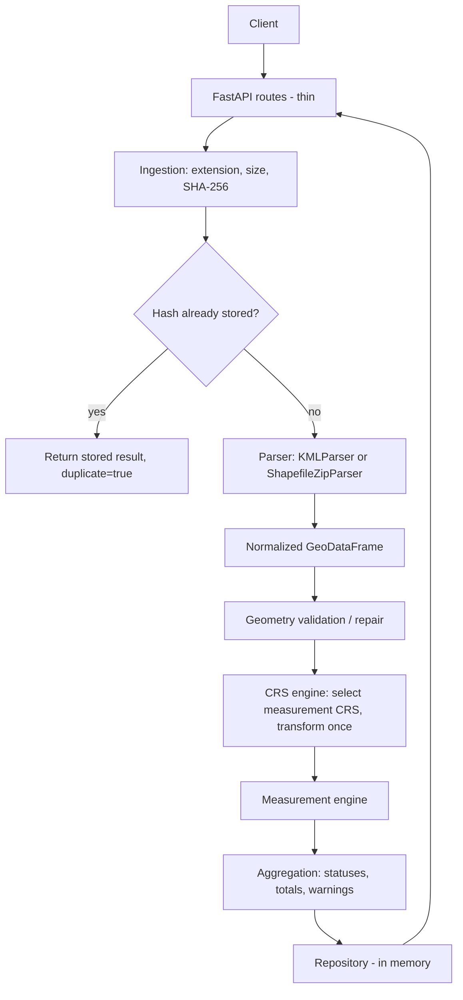

# Architecture

GeoMeasure is a layered, synchronous pipeline. Each stage lives in its own module and can be
tested without HTTP.



## Modules

| Module | Responsibility |
|---|---|
| `api/routes_files.py`, `routes_health.py` | HTTP only: parse request, call a service, return a schema |
| `services/processor.py` | Orchestrates the pipeline; the only module that knows the stage order |
| `services/ingestion.py` | Upload validation, chunked read, SHA-256 |
| `core/security.py` | Extension checks, ZIP validation, safe extraction |
| `services/parser.py` | `GeospatialParser` ABC, `KMLParser`, `ShapefileZipParser` |
| `services/geometry.py` | Per-feature validity check and `make_valid` repair; GeoJSON export |
| `services/crs.py` | Source CRS inspection, UTM selection, single transformation |
| `services/measurement.py` | Area / length in metres, units, presentation rounding |
| `services/serialization.py` | JSON-safe conversion of feature properties |
| `services/reporting.py` | Pagination, filtering and summary views over stored results |
| `storage/memory.py` | `ResultRepository` protocol and in-memory implementation |
| `core/exceptions.py` | Domain errors with `code` and `status_code`; mapped in `main.py` |

`serialization.py` and `reporting.py` are small additions to the brief's layout; they keep
`processor.py` and the routes focused.

## Normalized representation

Both parsers return a `GeoDataFrame` with the columns `geometry`, `feature_id`, `properties`
(a dict per feature) and `parse_error`, plus a CRS. Nothing after the parser knows which format
the data came from.

## Error model

- **Dataset-level failures** (bad ZIP, missing CRS, unreadable KML, unsupported file type) raise
  a `GeoMeasureError` subclass and become a structured `{"error": {code, message}}` response.
  Nothing is stored.
- **Feature-level failures** (empty/unrepairable geometry, unparseable Placemark, non-finite
  result) are recorded on that feature with `status=FAILED`; the other features are unaffected.
- Unexpected exceptions are logged server-side and returned as a generic `INTERNAL_ERROR`.

## Scaling path (not implemented)

`FileProcessor.process_ingested` is synchronous, takes plain inputs and returns a record, so it
can be called from a worker instead of a request thread:

```
FastAPI -> job API -> queue (Redis) -> worker(process_ingested) -> PostGIS / S3 -> result API
```

Only the repository implementation and the call site would change.
